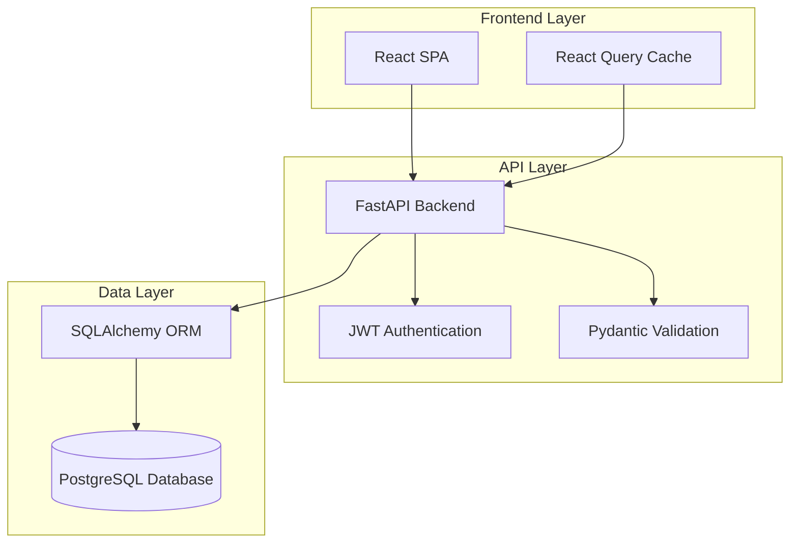
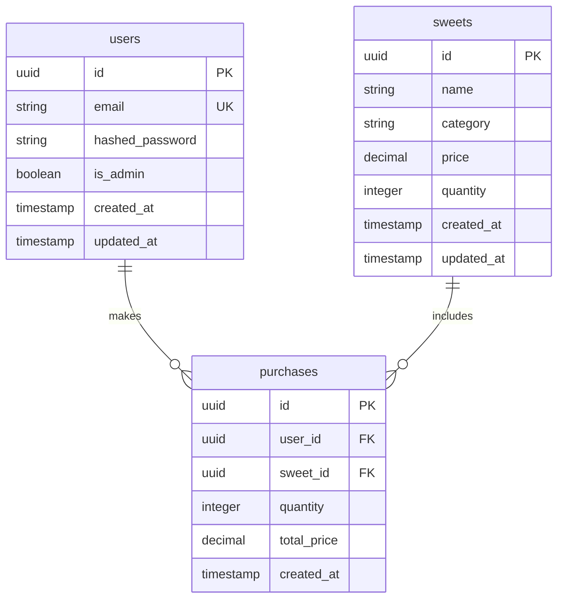
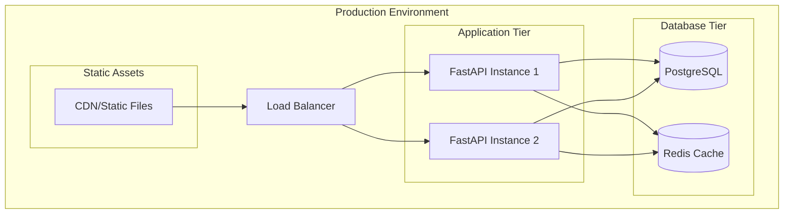

# Design Document

## Overview

The Sweet Shop Management System is a full-stack web application built using modern technologies and following test-driven development practices. The system consists of a FastAPI backend with PostgreSQL database and a React frontend, designed for high performance, scalability, and maintainability.

### Technology Stack

**Backend:**
- Python 3.11+ with FastAPI framework
- PostgreSQL database with SQLAlchemy ORM
- JWT authentication using python-jose
- Pydantic for data validation
- Pytest for testing
- Alembic for database migrations

**Frontend:**
- React 18 with JavaScript
- Vite for build tooling
- Tailwind CSS for styling
- React Query for state management and API calls
- React Hook Form for form handling
- Vitest and React Testing Library for testing

## Architecture

### System Architecture



### Database Schema



## Components and Interfaces

### Backend Components

#### 1. Authentication Service
```python
class AuthService:
    def create_access_token(self, data: dict) -> str
    def verify_token(self, token: str) -> dict
    def hash_password(self, password: str) -> str
    def verify_password(self, plain_password: str, hashed_password: str) -> bool
```

#### 2. User Service
```python
class UserService:
    def create_user(self, user_data: UserCreate) -> User
    def authenticate_user(self, email: str, password: str) -> User | None
    def get_user_by_email(self, email: str) -> User | None
```

#### 3. Sweet Service
```python
class SweetService:
    def create_sweet(self, sweet_data: SweetCreate) -> Sweet
    def get_sweets(self, skip: int = 0, limit: int = 100) -> List[Sweet]
    def search_sweets(self, query: str, category: str = None, 
                     min_price: float = None, max_price: float = None) -> List[Sweet]
    def update_sweet(self, sweet_id: uuid.UUID, sweet_data: SweetUpdate) -> Sweet
    def delete_sweet(self, sweet_id: uuid.UUID) -> bool
    def purchase_sweet(self, sweet_id: uuid.UUID, user_id: uuid.UUID) -> Purchase
    def restock_sweet(self, sweet_id: uuid.UUID, quantity: int) -> Sweet
```

#### 4. API Endpoints Structure
```
/api/v1/
├── auth/
│   ├── POST /register
│   └── POST /login
├── sweets/
│   ├── GET /
│   ├── POST / (admin)
│   ├── GET /search
│   ├── PUT /{sweet_id} (admin)
│   ├── DELETE /{sweet_id} (admin)
│   ├── POST /{sweet_id}/purchase
│   └── POST /{sweet_id}/restock (admin)
└── users/
    └── GET /me
```

### Frontend Components

#### 1. Authentication Components
- `LoginForm`: User login interface
- `RegisterForm`: User registration interface
- `AuthProvider`: Context provider for authentication state

#### 2. Sweet Management Components
- `SweetGrid`: Display grid of available sweets
- `SweetCard`: Individual sweet display component
- `SearchBar`: Search and filter interface
- `AdminSweetForm`: Admin form for adding/editing sweets
- `PurchaseButton`: Purchase action component

#### 3. Layout Components
- `Header`: Navigation and user menu
- `Layout`: Main application layout wrapper
- `AdminLayout`: Administrative interface layout

#### 4. State Management
```javascript
// React Query hooks
const useSweets = () => useQuery(['sweets'], fetchSweets)
const useSearchSweets = (query) => useQuery(['sweets', 'search', query], () => searchSweets(query))
const usePurchaseSweet = () => useMutation(purchaseSweet)
const useCreateSweet = () => useMutation(createSweet)
```

## Data Models

### Backend Models (Pydantic)

```python
class UserBase(BaseModel):
    email: EmailStr

class UserCreate(UserBase):
    password: str

class User(UserBase):
    id: uuid.UUID
    is_admin: bool
    created_at: datetime

class SweetBase(BaseModel):
    name: str
    category: str
    price: Decimal
    quantity: int

class SweetCreate(SweetBase):
    pass

class SweetUpdate(BaseModel):
    name: Optional[str] = None
    category: Optional[str] = None
    price: Optional[Decimal] = None
    quantity: Optional[int] = None

class Sweet(SweetBase):
    id: uuid.UUID
    created_at: datetime
    updated_at: datetime

class PurchaseCreate(BaseModel):
    sweet_id: uuid.UUID

class Purchase(BaseModel):
    id: uuid.UUID
    user_id: uuid.UUID
    sweet_id: uuid.UUID
    quantity: int
    total_price: Decimal
    created_at: datetime
```

### Frontend Data Structures (JavaScript)

```javascript
// User object structure
const user = {
  id: 'string',
  email: 'string',
  isAdmin: 'boolean',
  createdAt: 'string'
};

// Sweet object structure
const sweet = {
  id: 'string',
  name: 'string',
  category: 'string',
  price: 'number',
  quantity: 'number',
  createdAt: 'string',
  updatedAt: 'string'
};

// Auth state structure
const authState = {
  user: null, // User object or null
  token: null, // string or null
  isAuthenticated: false // boolean
};

// Search filters structure
const searchFilters = {
  query: '', // optional string
  category: '', // optional string
  minPrice: null, // optional number
  maxPrice: null // optional number
};
```

## Error Handling

### Backend Error Handling

1. **Validation Errors**: Pydantic automatically handles request validation
2. **Authentication Errors**: Custom middleware for JWT validation
3. **Business Logic Errors**: Custom exception classes with appropriate HTTP status codes
4. **Database Errors**: SQLAlchemy exception handling with rollback mechanisms

```python
class SweetNotFoundError(HTTPException):
    def __init__(self):
        super().__init__(status_code=404, detail="Sweet not found")

class InsufficientStockError(HTTPException):
    def __init__(self):
        super().__init__(status_code=400, detail="Insufficient stock for purchase")

class UnauthorizedError(HTTPException):
    def __init__(self):
        super().__init__(status_code=401, detail="Authentication required")
```

### Frontend Error Handling

1. **API Errors**: React Query error boundaries and error states
2. **Form Validation**: React Hook Form with real-time validation
3. **Network Errors**: Retry mechanisms and offline handling
4. **User Feedback**: Toast notifications and error messages

```javascript
const ErrorBoundary = ({ children }) => {
  // Error boundary implementation
};

const useErrorHandler = () => {
  const showError = (error) => {
    toast.error(error.message);
  };
  return { showError };
};
```

## Testing Strategy

### Backend Testing

1. **Unit Tests**: Test individual functions and methods
   - Service layer methods
   - Utility functions
   - Data validation

2. **Integration Tests**: Test API endpoints
   - Authentication flows
   - CRUD operations
   - Business logic scenarios

3. **Database Tests**: Test data persistence
   - Model relationships
   - Constraint validation
   - Migration scripts

```python
# Example test structure
class TestSweetService:
    def test_create_sweet_success(self):
        # Test successful sweet creation
        
    def test_create_sweet_duplicate_name(self):
        # Test duplicate name handling
        
    def test_purchase_sweet_success(self):
        # Test successful purchase
        
    def test_purchase_sweet_insufficient_stock(self):
        # Test insufficient stock scenario
```

### Frontend Testing

1. **Unit Tests**: Test individual components
   - Component rendering
   - User interactions
   - State management

2. **Integration Tests**: Test component interactions
   - Form submissions
   - API integration
   - Navigation flows

3. **End-to-End Tests**: Test complete user journeys
   - User registration and login
   - Sweet browsing and purchase
   - Admin operations

```javascript
// Example test structure
describe('SweetCard Component', () => {
  it('renders sweet information correctly', () => {
    // Test component rendering
  });
  
  it('disables purchase button when out of stock', () => {
    // Test stock-based button state
  });
  
  it('calls purchase API when button clicked', () => {
    // Test purchase interaction
  });
});
```

### Test-Driven Development Approach

1. **Red Phase**: Write failing tests first
2. **Green Phase**: Implement minimal code to pass tests
3. **Refactor Phase**: Improve code while maintaining test coverage

### Performance Considerations

1. **Database Optimization**:
   - Proper indexing on frequently queried fields
   - Connection pooling
   - Query optimization

2. **API Performance**:
   - Response caching for static data
   - Pagination for large datasets
   - Async/await for non-blocking operations

3. **Frontend Performance**:
   - Code splitting and lazy loading
   - Image optimization
   - Memoization of expensive computations
   - Virtual scrolling for large lists

### Security Considerations

1. **Authentication Security**:
   - JWT token expiration
   - Secure password hashing (bcrypt)
   - HTTPS enforcement

2. **API Security**:
   - Input validation and sanitization
   - Rate limiting
   - CORS configuration

3. **Database Security**:
   - SQL injection prevention through ORM
   - Database connection encryption
   - Principle of least privilege for database access

### Deployment Architecture



This design provides a solid foundation for building a scalable, maintainable, and testable Sweet Shop Management System that meets all the specified requirements while following modern development best practices.